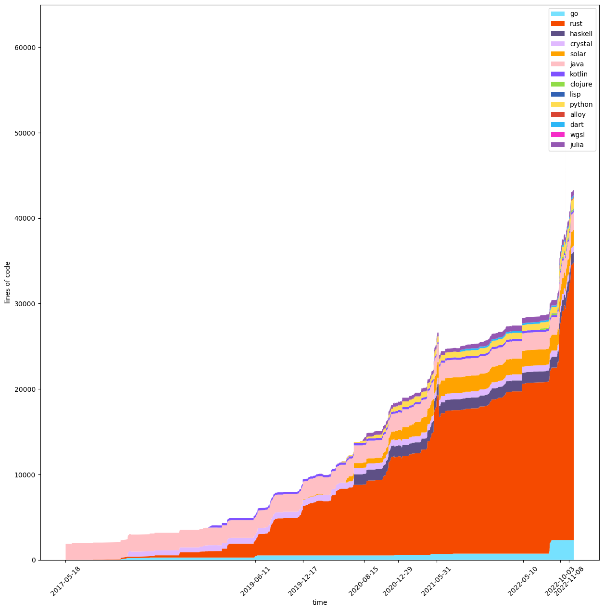

### Hello there! I'm Nils

I love coding and I'm enthusiastic about all things computer science 🫀

I have created a tool to visualize my GitHub History, so here's how many lines of code I've uploaded so far :)

